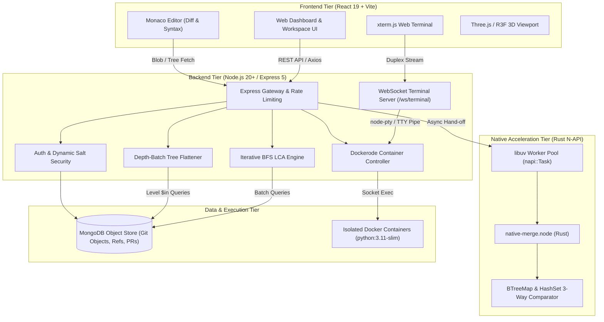
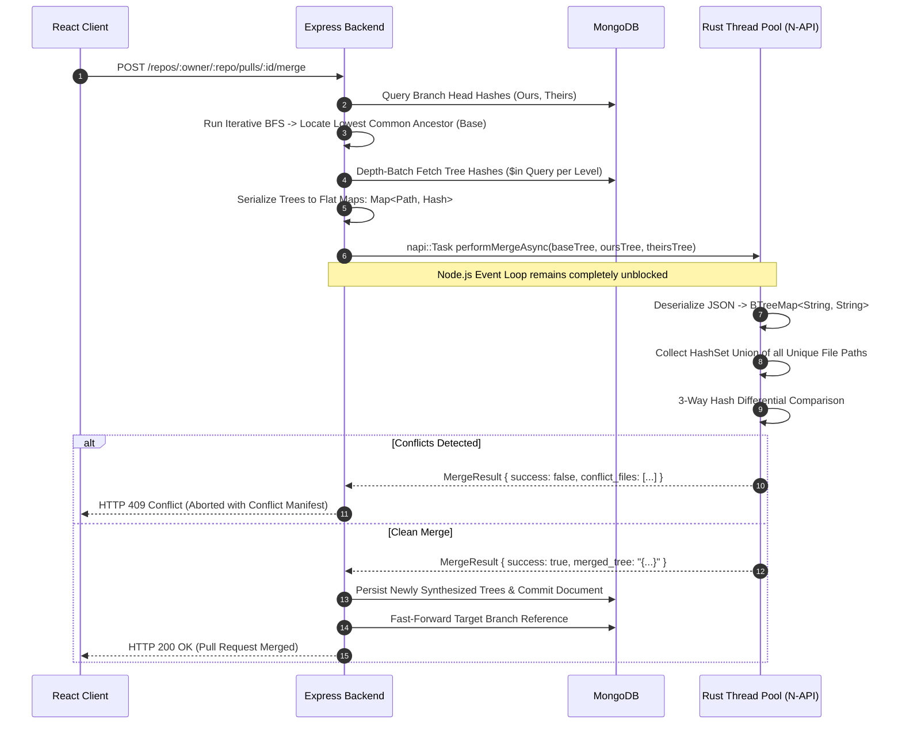
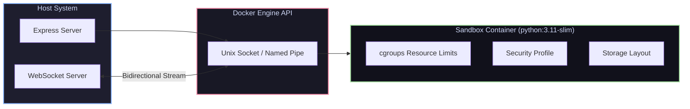

<div align="center">

# GIT-RUST VERSION CONTROL PLATFORM

### Distributed Version Control Engine with Native Rust 3-Way Merge & Cloud Sandboxing

<p align="center">
  
  
  
  
  
  
  
  
  
</p>

<p align="center">
  <a href="#architectural-topography">Architecture</a> &bull;
  <a href="#native-rust-merge-engine">Rust Native Engine</a> &bull;
  <a href="#git-object-internals">Git Internals</a> &bull;
  <a href="#docker-sandboxing">Docker Sandbox</a> &bull;
  <a href="#security--cryptography">Security</a> &bull;
  <a href="#quickstart">Quickstart</a> &bull;
  <a href="#api-reference">API Docs</a>
</p>

---

</div>

## Architectural Topography



---

## Native Rust Merge Engine

Standard JavaScript-driven diff engines block the single-threaded Node.js event loop during recursive traversals of complex repositories. The platform delegates compute-intensive tree operations to a compiled Rust native addon (`native-merge.node`) via **N-API** (`napi-rs`), executing asynchronously on the `libuv` background thread pool.



### Three-Way Comparator Logic

The Rust engine processes file nodes through the following state machine:

| Ours Hash | Theirs Hash | Base Hash | Resolution Action | Result Status |
| :--- | :--- | :--- | :--- | :--- |
| `H1` | `H1` | `H0` or `H1` | Identity Match | Retain `H1` |
| `H0` (Unchanged) | `H2` (Modified) | `H0` | Fast-Forward Theirs | Retain `H2` |
| `H1` (Modified) | `H0` (Unchanged) | `H0` | Fast-Forward Ours | Retain `H1` |
| `H1` (Modified) | `H2` (Modified) | `H0` | Divergent Modification | **Flag Conflict** |
| `None` (Deleted) | `H0` (Unchanged) | `H0` | Deletion Accepted | Delete Path |
| `H0` (Unchanged) | `None` (Deleted) | `H0` | Deletion Accepted | Delete Path |
| `H1` (Modified) | `None` (Deleted) | `H0` | Modify vs Delete | **Flag Conflict** |

---

## Git Object Internals

### Content-Addressable Storage Architecture

Git primitives are stored as content-addressed documents in MongoDB, guaranteeing immutability and deduplication:

```
+-----------------------------------------------------------------------------------+
| GitObject Schema                                                                  |
+-----------------------------------------------------------------------------------+
| _id          : ObjectId("...")                                                    |
| repositoryId : ObjectId("...")                 [Indexed]                          |
| hash         : "e3b0c44298fc1c149afbf4c899..." [SHA-256 Content Addressed]       |
| type         : "blob" | "tree" | "commit"      [Indexed with repositoryId]        |
| data         : String                          [Serialized Payload]               |
| pushedBy     : ObjectId("...")                 [Indexed]                          |
+-----------------------------------------------------------------------------------+
```

### Iterative BFS Graph Traversal for LCA

Determining the merge base between branches avoids recursive call stack exhaustion by employing a double-ended breadth-first search across commit parent pointers:

$$\text{Queue}_{\text{head}} \cap \text{Ancestors}_{\text{base}} \neq \emptyset \implies \text{Candidate LCA}$$

```
Commit Graph:
      (A) <--- (B) <--- (C) [main]
        ^
         \--- (D) <--- (E) [feature]

Traversal Steps:
1. headQueue = [C], baseQueue = [E]
2. Fetch parent commits in batch using $in operator
3. Populate ancestor sets: headAncestors={C, B, A}, baseAncestors={E, D, A}
4. Detect intersection at commit (A)
5. Sort intersection candidates by commit timestamp -> (A) selected as LCA
```

### Depth-Batch Tree Flattener (Anti-N+1 Pipeline)

Translating hierarchical Git trees into a flattened file map (`{"src/index.js": "<hash>"}`) typically incurs the $N+1$ query hazard. The engine traverses directory levels using depth-batched retrieval:

```
Queue Level 0: [ Root_Tree_Hash ]
      │
      ├── Single Query: GitObject.find({ hash: { $in: [Root_Tree_Hash] } })
      ▼
Queue Level 1: [ Hash_src, Hash_docs, Hash_config ]
      │
      ├── Single Query: GitObject.find({ hash: { $in: [Hash_src, Hash_docs, Hash_config] } })
      ▼
Queue Level 2: [ Hash_src_utils, Hash_src_controllers ]
      │
      └── Single Query: GitObject.find({ hash: { $in: [Hash_src_utils, ...] } })
```

Total database operations are bounded strictly by tree depth:

$$\mathcal{O}(\text{depth}) \ll \mathcal{O}(\text{total directories})$$

---

## Docker Sandboxing

Untrusted user code executed in the browser IDE or terminal streams inside isolated, ephemeral Docker containers managed through `dockerode`:



### Container Isolation Profile

```json
{
  "Image": "python:3.11-slim",
  "NetworkDisabled": true,
  "HostConfig": {
    "Memory": 268435456,
    "MemorySwap": 268435456,
    "NanoCpus": 500000000,
    "PidsLimit": 64,
    "Privileged": false,
    "CapDrop": ["ALL"],
    "ReadonlyRootfs": true,
    "Tmpfs": {
      "/tmp": "rw,noexec,nosuid,size=64m"
    }
  }
}
```

- **Memory Boundary**: Hard 256MB RAM cap (`MemorySwap: 256MB`).
- **CPU Quota**: 0.5 CPU cores (`NanoCpus: 500000000`).
- **Process Cap**: Max 64 processes (`PidsLimit: 64`) preventing fork bomb exploits.
- **Root Filesystem Lockdown**: Read-only rootfs prevents tampering; scratch space restricted to memory-backed volatile `/tmp` mounts.
- **Kernel Privileges**: Drops all Linux capabilities (`CapDrop: ['ALL']`).
- **Lifecycle Cleanup**: Graceful shutdown handles SIGINT/SIGTERM by terminating active sandboxes, complemented by watchdog timeout handlers.

---

## Security & Cryptography

```
                                  USER AUTHENTICATION
                                           │
                                           ▼
                     User Document: { email, securitySalt, ... }
                                           │
                                           ▼
                 ┌──────────────────────────────────────────────────┐
                 │          Dynamic Secret Derivation               │
                 │   Secret = HMAC-SHA256(Pepper, securitySalt)     │
                 └─────────────────────────┬────────────────────────┘
                                           │
                        ┌──────────────────┴──────────────────┐
                        ▼                                     ▼
             Signed Access Token                   Opaque Refresh Token
             (JWT: 15-Minute Expiry)              (Stored Hashed in DB)
                        │                                     │
                        │                                     ▼
                        │                         Password Reset / Logout All
                        │                                     │
                        │                                     ▼
                        │                         Regenerate securitySalt
                        │                                     │
                        ▼                                     ▼
             Token Verification Fails        All Distributed Tokens Instantly
             (Signature Mismatch)            Invalidated (Zero Redis Blocklists)
```

### Dynamic Security Salt Revocation

Rather than storing invalidated tokens in a distributed Redis denylist, each token verification step derives its signing key dynamically:

$$\text{SigningKey} = \text{HMAC-SHA256}(\text{JWT\_PEPPER\_SECRET}, \text{user.securitySalt})$$

When a user alters credentials or triggers a session termination, `securitySalt` regenerates immediately. All existing distributed tokens become instantly invalid across all edge nodes.

### Multi-Factor Step-Up Enforcement

Sensitive mutations require secondary verification via One-Time Passwords (OTP):
- High-privilege routes: Personal Access Token (PAT) generation, repository deletion, PAT revocation.
- Cryptographic code generated using `crypto.randomInt` (6 digits).
- Hashed using `bcryptjs` before persistence in a dedicated collection with a 15-minute Time-To-Live (TTL).
- Hard limit of 3 failed verification attempts before permanent token invalidation.

---

## Technical Stack Matrix

<div align="center">

| Layer | Component | Version | Role / Justification |
| :--- | :--- | :--- | :--- |
| **Native Systems** | Rust | Edition 2021 | High-throughput, memory-safe 3-way tree merge algorithm |
| **Native Bridge** | `@napi-rs/cli` | `^3.10.6` | Zero-copy Node.js C++ FFI bindings to Rust native binaries |
| **Backend Runtime** | Node.js | `>=20.0.0` | Asynchronous I/O, event-driven web and WebSocket service |
| **HTTP Framework** | Express | `^5.2.1` | REST routing, middleware orchestration, and error dispatch |
| **Database** | MongoDB | `>=6.0.0` | Content-addressable document store for Git objects and metadata |
| **Object Modeling** | Mongoose | `^9.7.4` | Schema enforcement, validation hooks, and compound indexing |
| **Sandboxing** | Docker / Dockerode | `^5.0.1` | Kernel-isolated, resource-constrained container environments |
| **Terminal Protocol** | `ws` / `node-pty` | `^8.22.0` | Real-time bidirectional WebSocket transport to pseudo-terminals |
| **Frontend Runtime** | React | `^19.2.8` | Declarative UI layer with concurrent rendering capabilities |
| **Client Bundler** | Vite | `^8.2.0` | Ultra-fast ESM-driven build tooling and hot-module replacement |
| **Code Editor** | Monaco Editor | `^4.7.0` | In-browser multi-file IDE with side-by-side diffing |
| **Terminal Emulator** | `xterm.js` | `^5.3.0` | GPU-accelerated ANSI terminal rendering in browser |
| **3D Rendering** | Three.js / R3F | `^0.185.1` | WebGL canvas rendering for 3D interactive interfaces |
| **Styling** | Tailwind CSS | `^4.3.3` | Utility-first responsive CSS styling engine |

</div>

---

## Directory Layout

```
git_version_control/
├── backend/
│   ├── native-merge/                # Rust Native Merge Crate
│   │   ├── Cargo.toml               # Crate dependencies & compiler flags
│   │   ├── build.rs                 # N-API build orchestration
│   │   └── src/
│   │       └── lib.rs               # Rust 3-way merge logic & background task
│   ├── src/
│   │   ├── config/                  # Cloudinary, database, and system configs
│   │   ├── controllers/             # Endpoint handlers
│   │   │   ├── auth.controller.js   # Authentication, verification, and OAuth
│   │   │   ├── pr.controller.js     # Pull requests & Rust merge invocation
│   │   │   ├── repo.core.controller.js # Repository lifecycle & management
│   │   │   ├── repo.git.controller.js  # Commits, blobs, trees, diff generation
│   │   │   └── repo.cli.controller.js  # Git client push/fetch protocol endpoints
│   │   ├── middlewares/             # Security, rate limiting, and Zod validation
│   │   ├── models/                  # Mongoose schemas (GitObject, User, PR, etc.)
│   │   ├── routes/                  # REST and WebSocket route definitions
│   │   ├── services/                # Docker sandbox, PTY terminal, and token service
│   │   └── utils/                   # Iterative BFS LCA, depth flattener, loggers
│   ├── server.js                    # Server startup, WebSocket upgrade, shutdown logic
│   └── package.json                 # Node dependencies and scripts
│
├── frontend/
│   ├── src/
│   │   ├── components/
│   │   │   ├── ide/                 # Monaco Editor, FileTree, xterm Terminal
│   │   │   ├── repo/                # Code browser, Commits, PRs, Settings
│   │   │   └── WaveScene.jsx        # WebGL 3D dynamic scene
│   │   ├── pages/                   # Application views (Dashboard, Repo, IDE, Auth)
│   │   ├── store/                   # Zustand state management
│   │   └── App.jsx                  # Client routing root
│   ├── vite.config.js               # Vite build pipeline
│   └── package.json                 # Client dependencies
│
└── README.md                        # Project documentation
```

---

## Quickstart

### Prerequisites

- **Node.js**: `v20.0.0` or higher
- **Rust Toolchain**: `rustc` and `cargo` `1.70.0` or higher
- **MongoDB**: `v6.0` or higher active instance
- **Docker Engine**: Docker daemon running with accessible socket
- **Package Manager**: `npm` or `pnpm`

### Step 1: Compile Native Rust Module

```bash
cd backend/native-merge
npm install
npm run build
```

This compiles `src/lib.rs` into the native binary `backend/native-merge.node`.

### Step 2: Configure & Start Backend

```bash
cd .. # Navigate to backend root
npm install
```

Configure your environment in `backend/.env`:

```ini
PORT=5000
MONGODB_URI=mongodb://localhost:27017/git_version_control
JWT_SECRET=production_system_jwt_secret_key
JWT_PEPPER_SECRET=production_dynamic_pepper_seed
FRONTEND_URL=http://localhost:5173

# Optional: Resend Service for OTP Delivery
RESEND_API_KEY=re_your_api_key

# Optional: Cloudinary Configuration
CLOUDINARY_CLOUD_NAME=your_cloud_name
CLOUDINARY_API_KEY=your_cloudinary_key
CLOUDINARY_API_SECRET=your_cloudinary_secret

# Optional: Google OAuth 2.0 Credentials
GOOGLE_CLIENT_ID=your_client_id
GOOGLE_CLIENT_SECRET=your_client_secret
```

Launch the service:

```bash
# Development with hot reload
npm run dev

# Production
npm start
```

### Step 3: Configure & Start Frontend

```bash
cd ../frontend
npm install
```

Configure `frontend/.env`:

```ini
VITE_API_BASE_URL=http://localhost:5000/api/v1
VITE_WS_URL=ws://localhost:5000
```

Start Vite dev server:

```bash
npm run dev
```

Navigate to `http://localhost:5173` in your browser.

---

## API Reference

Interactive OpenAPI documentation is hosted at `http://localhost:5000/api-docs`.

<details>
<summary><strong>Authentication & Security Endpoints</strong></summary>

```
POST   /api/v1/auth/register             # Register local account & dispatch verification OTP
POST   /api/v1/auth/verify-email          # Validate OTP, activate account, issue session tokens
POST   /api/v1/auth/login                 # Password authentication, return JWT & refresh cookie
POST   /api/v1/auth/refresh               # Rotate refresh token and issue fresh access token
POST   /api/v1/auth/forgot-password       # Request password reset challenge
POST   /api/v1/auth/reset-password        # Reset password & invalidate global security salts
POST   /api/v1/auth/cli/login             # Authenticate CLI client with Personal Access Token
POST   /api/v1/tokens/request-otp         # Issue step-up challenge OTP for PAT operations
POST   /api/v1/tokens                     # Generate new cryptographically hashed PAT
GET    /api/v1/tokens                     # List active PAT metadata (hashes redacted)
DELETE /api/v1/tokens/:tokenId            # Revoke PAT (requires step-up OTP challenge)
```

</details>

<details>
<summary><strong>Repository & Git Primitives Endpoints</strong></summary>

```
GET    /api/v1/repos                      # Query repositories for authenticated user
POST   /api/v1/repos                      # Initialize new repository
GET    /api/v1/repos/:owner/:repo         # Resolve repository metadata and active ref pointers
GET    /api/v1/repos/:owner/:repo/tree    # Return flattened/nested tree at branch or commit
GET    /api/v1/repos/:owner/:repo/blob/:h # Fetch raw blob payload by object hash
GET    /api/v1/repos/:owner/:repo/commits # Retrieve commit history with parent references
GET    /api/v1/repos/:owner/:repo/compare # Compute commit graph divergence across refs
GET    /api/v1/repos/:owner/:repo/zip     # Stream on-the-fly zip archive of repository tree
DELETE /api/v1/repos/:owner/:repo         # Delete repository (requires step-up OTP challenge)
```

</details>

<details>
<summary><strong>Pull Requests & Native Merge Engine Endpoints</strong></summary>

```
GET    /api/v1/repos/:owner/:repo/pulls          # Query pull requests by status (open/closed/merged)
POST   /api/v1/repos/:owner/:repo/pulls          # Open pull request between refs
GET    /api/v1/repos/:owner/:repo/pulls/:id      # Fetch PR metadata, commits, and unified diff
POST   /api/v1/repos/:owner/:repo/pulls/:id/merge # Execute Rust 3-way merge and update target ref
POST   /api/v1/repos/:owner/:repo/pulls/:id/comments # Post review comment or line discussion
```

</details>

<details>
<summary><strong>IDE, Cloud Sandboxing & WebSocket Endpoints</strong></summary>

```
POST   /api/v1/ide/load-codespace         # Provision sandbox workspace with repo or blob content
GET    /api/v1/ide/files                  # Enumerate workspace filesystem structure
POST   /api/v1/ide/execute                # Dispatch isolated code execution job to Docker
WS     /ws/terminal                       # Upgraded duplex connection attached to Docker PTY
```

</details>
